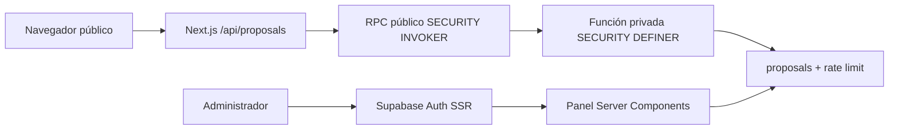

# Arquitectura

## Componentes

La App Router de Next.js sirve la portada y privacidad como contenido público. `/api/proposals/token` emite un comprobante HMAC temporal y `/api/proposals` valida, normaliza, aplica controles de origen/abuso y llama al RPC. El navegador nunca accede a la tabla de propuestas.

`/admin` usa Supabase SSR: `proxy.ts` actualiza cookies con `getClaims()`, el servidor comprueba que el UUID autenticado exista en `profiles` con rol `admin` y RLS vuelve a autorizar cada consulta. El panel y el CSV son dinámicos y `no-store`.

## Decisiones

- UTC para almacenamiento; `America/Guayaquil` para presentación.
- Sin dependencia de animación: entradas CSS y `prefers-reduced-motion`.
- Identidad institucional centralizada en `src/config/site.ts`; datos vacíos no se renderizan.
- Un único proyecto Vercel y una única base Supabase; secretos RPC diferentes por entorno Vercel.
